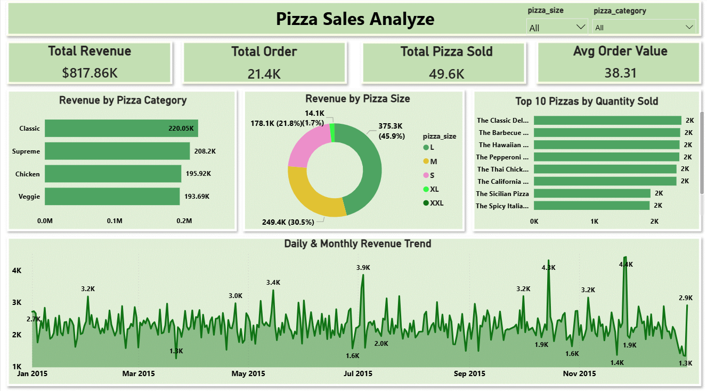

# 🍕 Pizza Sales Analysis using SQL & Power BI

## 📌 Project Overview
This project analyzes sales data from a pizza store to identify key business indicators such as bestselling categories, peak sales hours, and monthly revenue trends. The goal was to optimize inventory and marketing strategies based on data-driven insights.

*(Above: Snapshot of the interactive dashboard)*

## 📂 Files Description
* **`Pizza_Sales_SQL.sql`**: The MySQL scripts used to calculate total revenue, average order value (AOV), and category performance.
* **`pizza_sales_data.csv`**: Raw dataset containing order details, pizza types, sizes, and timestamps.
* **`pizza_dashboard.png`**: Visual representation of the insights.

## 🛠️ Tools Used
* **MySQL**: Used for querying large datasets, aggregating revenue, and extracting time-based trends (e.g., peak hours).
* **Power BI / Tableau**: Used to visualize the SQL outputs.

## 📊 Key Analysis & SQL Queries
The SQL script covers the following critical business questions:

1.  **KPI Analysis**: calculated Total Revenue, Total Orders, and Total Pizzas Sold.
2.  **Average Order Value (AOV)**: Determined the average spend per customer order.
3.  **Sales by Category**: Identified which pizza categories (Classic, Supreme, Veggie, Chicken) drive the most revenue.
4.  **Size Preference**: Analyzed sales distribution by pizza size (S, M, L, XL).
5.  **Time-Based Trends**:
    * *Daily Trend*: Which days of the week are busiest?
    * *Hourly Trend*: Identified peak order times (Lunch vs. Dinner rush).
6.  **Best Sellers**: Extracted the Top 10 pizzas by quantity sold to assist with inventory planning.

## 💻 How to Run This Project
1.  **Database Setup**: Create a database named `Pizza_Sales`.
2.  **Import Data**: Import the CSV file into a table named `pizza_sales`.
3.  **Run Queries**: Execute the `Pizza_Sales_SQL.sql` file to generate the reports.

## 📈 Insights Summary
* **Peak Hours**: Orders spike significantly between 12:00 PM - 1:00 PM (Lunch) and 5:00 PM - 8:00 PM (Dinner).
* **Best Category**: The "Classic" category contributes the highest percentage to total revenue.
* **Sales Trends**: Large pizzas have the highest order frequency, suggesting a trend toward group dining.

---
*Author: [ Rahul Agarwal ]*
*Connect with me on LinkedIn: [https://www.linkedin.com/in/rahul-agarwal-184596272/]*
